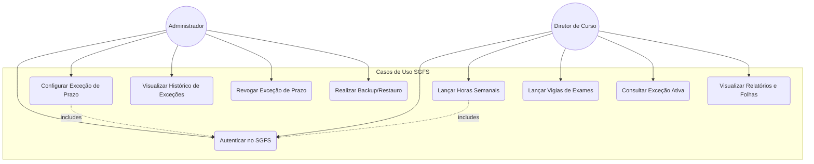
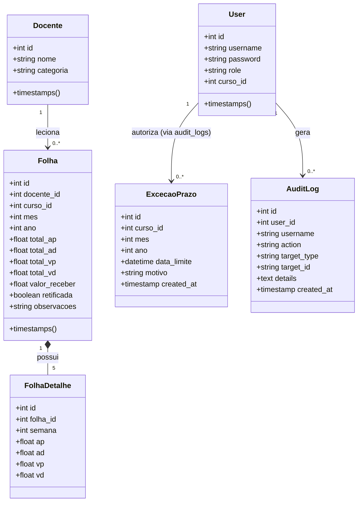
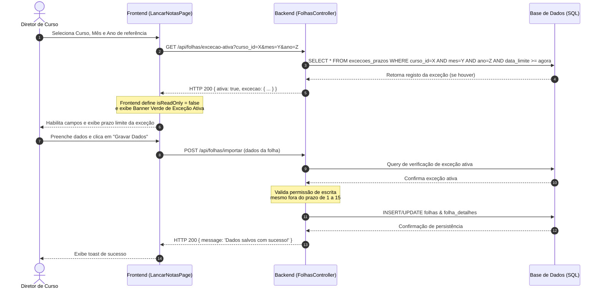
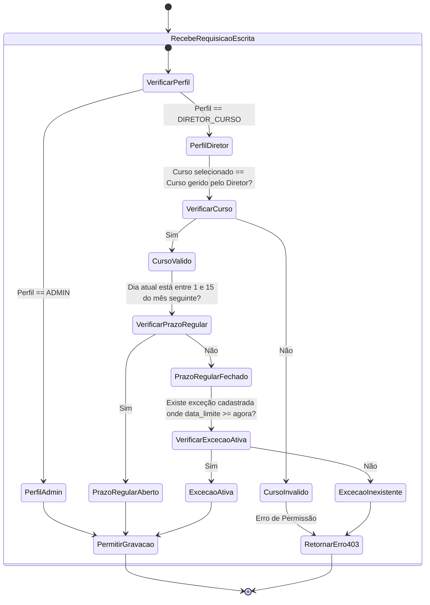

# 📋 Manual Técnico de Funcionalidades Implementadas

Este documento serve como guia explicativo detalhado de todas as novas funcionalidades, regras de negócio e melhorias de UI/UX implementadas no **Sistema de Gestão de Folha Salarial (SGFS)** do ISPT.

As alterações foram organizadas sob pilares de **segurança de dados**, **otimização de layout para dispositivos móveis (mobile)**, **persistência de estado** e **grelhas de relatórios profissionais**.

---

## 📱 1. Responsividade Mobile Premium (UI/UX)

Para garantir que o SGFS seja perfeitamente utilizável em celulares e tablets sem perdas de layout ou sobreposição de botões, realizamos intervenções estruturais em quatro módulos principais:

### A. Layout Geral (`MainLayout.jsx`)
* **Botão de Fecho do Menu (`X`):** Adicionado um ícone intuitivo de fecho no cabeçalho do menu lateral móvel para que o utilizador consiga recolher o menu lateral com um único toque.
* **Paddings Responsivos:** Reduzido o padding global do corpo da aplicação em ecrãs móveis de `p-8` para `p-4 sm:p-8`, libertando mais espaço útil para tabelas e formulários.

### B. Lançamento de Horas (`LancarNotasPage.jsx`)
* **Lista Ocultável de Docentes:** Em ecrãs pequenos, a barra lateral de seleção de docentes agora inicia de forma colapsada sob o botão interativo `📋 Lista de Docentes`. 
* **Posicionamento Inteligente:** Ao ser expandida pelo utilizador, a lista renderiza-se de forma fluida **abaixo** do formulário de lançamento ativo, evitando que a barra lateral bloqueie a área de digitação de horas.
* **Tabela com Scroll Horizontal:** A grade semanal e os botões de controle de lançamento ajustam-se automaticamente ao ecran, com rolagem horizontal contida na tabela de semanas.

### C. Relatórios e Folhas (`RelatoriosPage.jsx`)
* **Scroll Único:** Removido o scroll horizontal duplo do container de fundo da página. A navegação do ecran agora é estritamente vertical, e a grande tabela de pagamentos contém a sua própria barra de rolagem horizontal isolada e suave ao toque.
* **Filtros Flexíveis:** O formulário de seleção (Mês, Ano e Curso) empilha-se verticalmente em celulares, mantendo os botões de exportação perfeitamente enquadrados.

### D. Histórico e Auditoria (`AuditPage.jsx`)
* **Grid de Estatísticas Dinâmico:** Os cartões com os totais de atividades, logins, edições e remoções agora adaptam-se de forma fluida:
  - **1 coluna** em celulares de ecran pequeno.
  - **2 colunas (Layout 2x2)** em tablets.
  - **4 colunas** em computadores e telas largas.
* **Formulários e Filtros:** Os campos de pesquisa de logs e seletores de utilizadores ajustam-se verticalmente em telas móveis com espaçamentos harmoniosos.

---

## ⏱️ 2. Restrição de Lançamento de Horas para Diretores

Com o objetivo de proteger a integridade dos dados e otimizar o fluxo financeiro mensal, foi criada uma rígida validação temporal que limita as permissões dos **Diretores de Curso**, mantendo acesso total aos **Administradores**:

* **A Regra de Negócio:** Se um Diretor de Curso deseja lançar ou editar as aulas de um determinado mês $X$, ele apenas poderá efetuar alterações entre o **dia 1 e o dia 15 do mês subsequente** ($X + 1$).
  * *Exemplo:* As horas de **Maio** só podem ser inseridas ou modificadas de **1 a 15 de Junho**. Fora desse período, o lançamento fica fechado.
* **Bloqueio no Frontend:**
  - O sistema exibe um **banner de aviso vermelho** no topo da página informando que o período de lançamento está encerrado.
  - Todos os campos numéricos, botões de gravação, botões de remoção de docentes e botões de importação de CSV ficam totalmente desabilitados (`isReadOnly`).
* **Segurança no Backend:**
  - Adicionado middleware de segurança em `folhas.controller.js`. Mesmo que um utilizador tente contornar a interface, as requisições de salvamento, remoção ou importação enviadas por um Diretor fora do prazo permitido são sumariamente rejeitadas com erro `403 Forbidden`.

---

## 🔍 3. Lógica de Vigias no Modo Exame

A exibição e gravação das vigias de exames foram unificadas e tornadas persistentes para evitar retrabalho por parte do utilizador:

* **Sincronização via `localStorage`:** O estado do checkbox "Modo Exames" é guardado sob a chave `sgfs_show_vigias`. Ao marcar a opção no menu de lançamento, ela ativa-se automaticamente no menu de relatórios (e vice-versa).
* **Substituição Dinâmica de Cabeçalhos:** Ao ativar o modo de vigias na página de Relatórios:
  - As colunas semanais da tabela de folhas deixam de exibir **AP** (Aulas Programadas) / **AD** (Aulas Dadas) e passam a exibir **VP** (Vigias Programadas) / **VD** (Vigias Dadas).
  - O total geral de aulas passa a designar-se **Totais (Aulas & Vigias)** e **Total Vigias**.
  - Se desativado, as colunas de vigias e os seus totais são completamente ocultados das tabelas de pagamento para simplificar a visualização do modo normal.

---

## 📄 4. Tabela Estruturada na Declaração Individual (Falha)

O menu de **Declaração Individual (Falha no Lançamento)** em `RelatoriosPage.jsx` foi totalmente refatorado:

* **Estrutura Visual:** A tabela simplificada que realizava apenas somas gerais foi substituída pelo **mesmo formato de grade semanal detalhado** da tabela de relatórios principal do curso.
* **Foco no Docente Selecionado:** O template de impressão renderiza e exibe de forma exclusiva apenas a linha de dados correspondente ao docente que foi selecionado pelo utilizador, exibindo todas as 5 semanas detalhadas com AP, VP, AD e VD.
* **Conformidade de Impressão:** Garante que o documento individual gerado e impresso seja esteticamente idêntico ao modelo oficial das folhas gerais do ISPT.

---

## 🔑 5. Exceções de Prazo de Edição para Diretores (UI Administrativa)

Implementada a funcionalidade para permitir flexibilidade operacional no SGFS quando houver necessidade justificada de lançamento fora do período regulamentar (dias 1-15):

* **Painel Administrativo (`AdminConfigPage.jsx`):** Adicionado um novo módulo completo de gestão de exceções de prazos. O Administrador pode:
  - Selecionar um curso específico.
  - Selecionar o mês e ano de referência a ser liberado.
  - Definir uma data e hora limite no futuro para encerramento da exceção.
  - Inserir uma justificativa ou motivo.
* **Sincronização de Permissão:** O backend consulta dinamicamente a tabela de exceções (`excecoes_prazos`). Se houver uma exceção ativa para o curso e o período selecionado, as ações de escrita (`importar` e `deletarDocenteFolha`) são autorizadas no backend para Diretores de Curso.
* **UI Inteligente (`LancarNotasPage.jsx`):** Caso o período normal de lançamento esteja encerrado mas haja uma exceção ativa aberta pelo Admin:
  - O sistema remove o bloqueio de apenas leitura e libera as edições do Diretor.
  - Exibe um **banner verde dinâmico** informando que o lançamento está autorizado por exceção administrativa, apresentando a data limite exata e a justificativa cadastrada pelo Admin.

---

## 🧪 Como Verificar e Validar cada Funcionalidade

1. **Aceder via Celular (ou ferramenta de desenvolvimento do navegador):**
   - Entre em *Lançamento de Horas* e clique em *Individual*. O painel lateral de docentes estará recolhido de forma elegante sob o botão `📋 Lista de Docentes` e aparecerá abaixo do formulário principal ao ser ativado.
   - Vá em *Histórico e Auditoria* e veja os 4 cartões perfeitamente alinhados em grid responsivo.
2. **Validar Prazos do Diretor:**
   - Faça login com uma conta cujo papel seja `DIRETOR_CURSO`.
   - Selecione um mês cujo prazo já tenha expirado (ex: lançar aulas de Abril em Junho). Verifique o surgimento do banner informativo e o bloqueio automático de edição dos campos numéricos.
3. **Validar o Modo Exame:**
   - Ative a opção *Modo Exames (Vigias)* em *Lançamento de Horas*.
   - Navegue até *Relatórios e Folhas* e comprove que a opção já está marcada e os cabeçalhos das tabelas foram alterados automaticamente de `AP/AD` para `VP/VD`.
4. **Validar Impressão Individual:**
   - Em *Relatórios*, selecione um curso, ative a *Declaração Individual (Falha)*, escolha um docente cadastrado e verifique que a tabela gerada para impressão possui todas as colunas semanais estruturadas perfeitamente.
5. **Validar Abertura de Exceções:**
   - Como Administrador, aceda a *Configurações* e cadastre uma exceção de prazo para o curso de Engenharia Informática para o mês atual.
   - Faça login como Diretor de Informática e comprove que o lançamento para o mês correspondente foi liberado, exibindo o banner verde de exceção ativa.

---

## 🚀 5. Roadmap e Próximas Funcionalidades (Roadmap de Evolução)

Para continuar a elevar o nível tecnológico do SGFS do ISPT, sugerimos as seguintes implementações ordenadas de acordo com o impacto operacional e a complexidade técnica:

### 🗺️ Matriz de Prioridade de Novas Implementações

| Funcionalidade | Prioridade | Impacto | Esforço Estimado | Benefício Principal |
| :--- | :---: | :---: | :---: | :--- |
| **1. Fluxo de Submissão e Aprovação de Folhas** | 🔥 **Alta** | Crítico | Médio-Alto | Elimina papelada física e formaliza aprovações digitais de folhas de horas. |
| **2. Alertas e Notificações (E-mail e Internas)** | 🔥 **Alta** | Alto | Médio | Garante o cumprimento estrito do prazo regulamentar de lançamento (dias 1-15). |
| **3. Exceções de Prazo de Edição Solicitadas via UI** | ✅ **Concluído** | Alto | Baixo-Médio | Dá flexibilidade ao Admin para estender prazos a diretores específicos (Implementado). |
| **4. Dashboard Gráfico de Analytics (Analytics)** | ⚡ **Média** | Alto | Médio | Fornece visões de custos financeiros e taxas de faltas em tempo real. |
| **5. Upload de Comprovativos de Faltas Justificadas** | 💤 **Baixa** | Médio | Médio | Centraliza atestados e justificações de horas não dadas. |
| **6. Backup Automatizado de Segurança (DB)** | 💤 **Baixa** | Crítico | Baixo | Garante a integridade dos dados na base de dados SQLite do servidor. |

### 🔍 Detalhamento das Funcionalidades Propostas

#### 🔥 PRIORIDADE ALTA (Foco em Compliance e Produtividade)

##### 1. Fluxo de Submissão e Aprovação de Folhas
* **Funcionamento:** O Diretor do Curso clica em "Submeter Folha do Mês X". A folha entra em estado de **"Pendente de Aprovação"** e fica bloqueada para alterações. O Administrador (ou Financeiro) visualiza o registo na sua dashboard e pode **Aprovar** (pronta para o pagamento) ou **Rejeitar** (abrindo campo para feedback e reativando a edição temporária do diretor).
* **Benefício:** Formaliza digitalmente a verificação de contas antes do pagamento final.

##### 2. Alertas e Notificações (E-mail e Internos)
* **Funcionamento:** O sistema envia e-mails automáticos lembrando do prazo regulamentar do dia 15 aos Diretores com lançamentos pendentes, bem como avisa quando uma folha de horas foi aprovada ou rejeitada.
* **Benefício:** Aumenta a pontualidade e reduz atrasos nos envios.

#### ⚡ PRIORIDADE MÉDIA (Foco em Inteligência de Negócio e Gestão)

##### 4. Dashboard Gráfico de Analytics (com Recharts)
* **Funcionamento:** Exibição de gráficos de barras e linhas mostrando gastos com pagamento por curso, taxa de comparecimento (aulas dadas vs. programadas) e volume de vigias de exames.
* **Benefício:** Visibilidade instantânea para a diretoria administrativa.

#### 💤 PRIORIDADE BAIXA (Foco em Infraestrutura)

##### 5. Upload de Comprovativos de Faltas Justificadas
* **Funcionamento:** O Diretor de Curso pode arrastar e soltar ficheiros de atestados ou justificações em formato PDF/Imagem atrelados às justificações de faltas.

##### 6. Backup Automatizado de Segurança
* **Funcionamento:** Exportação programada automática diária do banco de dados SQLite para um armazenamento seguro fora do servidor da VPS.

---

## 🧠 6. Propostas Avançadas de Evolução (Engenharia de Requisitos)

Para alinhar a expansão do sistema com as melhores práticas de Engenharia de Software e Gestão Universitária, mapeámos as novas propostas de funcionalidades estruturadas em **Requisitos Funcionais (RF)**, **Requisitos Não Funcionais (RNF)** e **Regras de Negócio (RN)**.

---

### 💵 Funcionalidade A: Gestão de Escalões Salariais e Fórmulas de Cálculo

* **Regra de Negócio (RN):**
  - **RN-01 (Tabela de Tarifas):** O valor monetário da Hora Aula Dada ($AD$) e da Hora de Vigia Realizada ($VD$) varia de acordo com a Categoria Académica do docente (ex: Catedrático, Associado, Auxiliar, Assistente) ou Regime de Contratação (Tempo Inteiro vs. Tempo Parcial).
  - **RN-02 (Cálculo do Salário Ilíquido):** O salário ilíquido mensal de cada docente na folha deve seguir a fórmula rigorosa: 
    $$\text{Salário Ilíquido} = (\text{Total AD} \times \text{Tarifa AD}) + (\text{Total VD} \times \text{Tarifa VD})$$
* **Requisito Funcional (RF):**
  - **RF-01 (Configurador de Escalões):** O Administrador deve ter acesso a uma tela para definir e atualizar os valores de tarifa por hora de aula dada e vigia para cada categoria de docente.
  - **RF-02 (Cálculo Automatizado):** Ao fechar a folha, o sistema deve calcular de forma 100% automatizada e transparente o valor bruto a pagar a cada docente com base na sua categoria atual.
* **Requisito Não Funcional (RNF):**
  - **RNF-01 (Precisão Monetária):** Todos os cálculos salariais devem utilizar aritmética de alta precisão decimal (evitando erros de arredondamento de ponto flutuante típicos em Javascript) e ser apresentados com exatamente duas casas decimais.

---

### 🛡️ Funcionalidade B: Validação e Alertas de Carga Horária Limite

* **Regra de Negócio (RN):**
  - **RN-03 (Limite Legal de Horas):** Um docente do ISPT não pode ultrapassar o limite máximo de $N$ horas lecionadas semanalmente (ou $M$ horas mensais acumuladas), de acordo com a legislação do Ensino Superior e o regulamento interno.
* **Requisito Funcional (RF):**
  - **RF-03 (Bloqueio de Sobrecarga):** O sistema deve emitir um alerta impeditivo imediato no formulário de Lançamento de Horas se o Diretor tentar salvar valores semanais de AP ou AD que resultem na extrapolação do limite legal do docente.
* **Requisito Não Funcional (RNF):**
  - **RNF-02 (Tempo de Resposta Local):** A validação do somatório de horas e o disparo do alerta visual em tela devem ocorrer localmente no cliente (frontend) com tempo de processamento inferior a 150 milissegundos.

---

### 🔍 Funcionalidade C: Verificação de Autenticidade por Código QR

* **Regra de Negócio (RN):**
  - **RN-04 (Assinatura Eletrónica):** Qualquer relatório impresso ou declaração individual de falha gerada pelo sistema só possui validade jurídica e financeira se contiver uma assinatura eletrónica sob a forma de um código QR encriptado gerado pelo SGFS.
* **Requisito Funcional (RF):**
  - **RF-04 (QR Code nos PDFs):** O gerador de PDF de relatórios e declarações deve renderizar dinamicamente um Código QR no rodapé dos documentos.
  - **RF-05 (Rota Pública de Validação):** A leitura do Código QR por um telemóvel direcionará para uma página web pública do SGFS que exibirá o status do documento, o nome do docente e os valores exatos gravados no banco de dados para evitar fraude em documentos impressos rasurados.
* **Requisito Não Funcional (RNF):**
  - **RNF-03 (Segurança Criptográfica):** O token inserido na URL do QR Code deve ser gerado utilizando criptografia assimétrica baseada em chaves SHA-256, impedindo a falsificação ou geração de URLs válidas por terceiros.

---

*   **RN-05 (Imutabilidade de Logs):** Nenhum registo de folha de pagamento pode ser editado ou retificado sem que a versão anterior e a identidade do autor da modificação sejam permanentemente guardadas para fins de auditoria interna e fiscalização.
* **Requisito Funcional (RF):**
  - **RF-06 (Histórico de Versões):** O Administrador deve poder ver, para cada curso e mês de referência, uma lista cronológica de todas as submissões e alterações efetuadas, com a opção de "Comparar Diferenças" entre versões da folha (ex: *Versão 1 do Diretor* vs *Versão 2 retificada pelo Admin*).
* **Requisito Não Funcional (RNF):**
  - **RNF-04 (Rastreabilidade):** Os logs de auditoria devem ser imutáveis e armazenados em tabelas exclusivas com restrição de acesso e criptografia a nível de aplicação.

---

## 📋 7. Especificação de Requisitos Global do SGFS (Tabelas Gerais)

Esta seção consolida e mapeia formalmente todos os **Requisitos Funcionais (RF)**, **Requisitos Não Funcionais (RNF)** e **Regras de Negócio (RN)** que regem o funcionamento atual de todo o ecossistema do Sistema de Gestão de Folha Salarial do ISPT.

---

### 1. Tabela de Requisitos Funcionais (RF)

| ID | Módulo / Funcionalidade | Descrição do Requisito Funcional | Perfil Mínimo | Impacto |
| :--- | :--- | :--- | :---: | :---: |
| **RF-01** | Autenticação | Permitir que os utilizadores efetuem login seguro através de e-mail/username e senha criptografada. | Todos | Crítico |
| **RF-02** | Controlo de Acesso (RBAC) | Restringir o acesso a páginas e operações com base nos perfis: `ADMIN` e `DIRETOR_CURSO`. | Todos | Crítico |
| **RF-03** | Cadastro de Docentes | Permitir a criação, edição e remoção (CRUD) de docentes e a atribuição dos seus respetivos cursos lecionados. | `ADMIN` | Alto |
| **04** | Importação de Docentes | Importar em lote os docentes e as suas cargas horárias planeadas a partir de um ficheiro CSV estruturado. | `ADMIN` | Alto |
| **RF-05** | Lançamento de Horas | Inserir e atualizar as horas das Aulas Programadas (AP) e Aulas Dadas (AD) semana a semana (Semanas 1 a 5). | `DIRETOR_CURSO` | Crítico |
| **RF-06** | Modo Exames (Vigias) | Permitir o lançamento de Vigias Programadas (VP) e Vigias Dadas (VD) para períodos de exames. | `DIRETOR_CURSO` | Crítico |
| **RF-07** | Cálculo de Faltas Informativo | Apresentar em tempo real a previsão de faltas no painel de lançamento individual do docente através da fórmula `AP - AD`. | `DIRETOR_CURSO` | Médio |
| **RF-08** | Visualização de Folhas | Disponibilizar a visualização tabular das folhas salariais mensais de forma global ou filtrada por curso. | Todos | Crítico |
| **RF-09** | Exportação de Relatórios | Exportar as tabelas gerais de pagamentos e relatórios consolidados em formato CSV. | Todos | Alto |
| **RF-10** | Declaração Individual (Falha) | Emitir relatório individual de justificativa de atraso para o docente selecionado em formato de grade com as 5 semanas detalhadas. | Todos | Crítico |
| **RF-11** | Consulta de Histórico | Visualizar e pesquisar os logs de auditoria detalhados que registam as ações executadas no sistema. | `ADMIN` | Alto |
| **RF-12** | Limpeza de Auditoria | Limpar permanentemente os logs de atividades, mediante confirmação expressa de dupla etapa em tela. | `ADMIN` | Baixo |

---

### 2. Tabela de Requisitos Não Funcionais (RNF)

| ID | Categoria | Descrição do Requisito Não Funcional | Módulo Afetado | Prioridade |
| :--- | :--- | :--- | :--- | :--- |
| **RNF-01** | Segurança | As senhas dos utilizadores devem ser criptografadas de forma unidirecional usando algoritmos seguros (ex: bcrypt/argon2) antes de serem salvas. | Base de Dados | 🔥 **Alta** |
| **RNF-02** | Usabilidade / Responsivo | A interface web do sistema deve ser 100% responsiva, adaptando-se a telas móveis (celulares) e tablets sem perda de conteúdo. | Frontend Geral | 🔥 **Alta** |
| **RNF-03** | Portabilidade (Impressão) | As folhas de relatórios e a declaração de falha devem ocultar elementos desnecessários (como barras laterais e cabeçalhos web) ao imprimir para PDF. | Relatórios | 🔥 **Alta** |
| **RNF-04** | Confiabilidade / Transação | Operações em lote (como importação de CSV) devem ocorrer dentro de transações de base de dados para garantir consistência. | Importador CSV | ⚡ **Média** |
| **RNF-05** | Usabilidade (Persistência) | Preferências de exibição como o "Modo Vigias" devem ser salvas localmente no navegador (`localStorage`) para evitar reconfigurações. | Relatórios / Notas | ⚡ **Média** |
| **RNF-06** | Manutenibilidade | Utilização do ecossistema React com Tailwind CSS e React Query para garantir desacoplamento e rapidez de atualização da UI. | Frontend Geral | 💤 **Baixa** |

---

### 3. Tabela de Regras de Negócio (RN)

| ID | Nome da Regra | Descrição Detalhada da Regra de Negócio | Severidade |
| :--- | :--- | :--- | :--- |
| **RN-01** | Limitação de Prazo de Diretor | O utilizador com perfil `DIRETOR_CURSO` só pode lançar ou editar horas entre os **dias 1 e 15 do mês subsequente** ao de referência. | 🚫 **Bloqueio Total** |
| **RN-02** | Acesso Administrativo Total | O utilizador com perfil `ADMIN` não sofre qualquer restrição de data de lançamento de horas, podendo alterar meses retroativos. | Permissão |
| **RN-03** | Abrangência por Curso | Diretores de Curso só podem visualizar, cadastrar e editar docentes e lançar horas pertencentes aos seus cursos geridos. | 🚫 **Bloqueio Total** |
| **RN-04** | Modo Vigia Integrado | Ao ativar o "Modo Vigias", as horas semanais de VP e VD substituem as de AP e AD, e os totais de vigias são incluídos nos relatórios gerais. | Exibição |
| **RN-05** | Confidencialidade de Faltas | O indicador de "Previsão de Faltas" individual é de caráter meramente informativo e orientativo, não devendo constar na folha geral ou relatórios. | Omissão |

---

## 📐 8. Modelagem UML e Diagramas Técnicos (Exceções de Prazos)

Abaixo está detalhada a modelagem visual completa baseada em UML para a funcionalidade de gerenciamento de prazos sob demanda, documentando a arquitetura através de diagramas **Mermaid**.

---

### 1. Diagrama de Casos de Uso (Use Case Diagram)

Descreve as interações dos atores (Administrador e Diretor de Curso) com a funcionalidade de controle de períodos e exceções no SGFS.

---

### 2. Diagrama de Classes (Class Diagram)

Apresenta a modelagem relacional dos dados associados às exceções, histórico de auditoria e sua correlação com as tabelas fundamentais de folhas do SGFS.

---

### 3. Diagrama de Sequência (Sequence Diagram)

Demonstra a troca de mensagens entre o navegador (Frontend) e o servidor (Backend API) durante o fluxo de verificação de prazo e persistência de horas por um Diretor sob regime de exceção ativa.

---

### 4. Diagrama de Atividades (Activity Diagram)

Ilustra o fluxo lógico de decisão percorrido pelo backend para validar ou rejeitar uma requisição de gravação de horas com base na verificação temporal de prazos regulares ou exceções administrativas.

